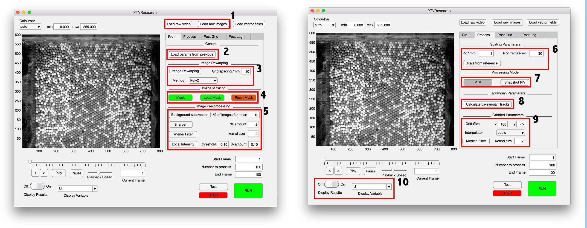
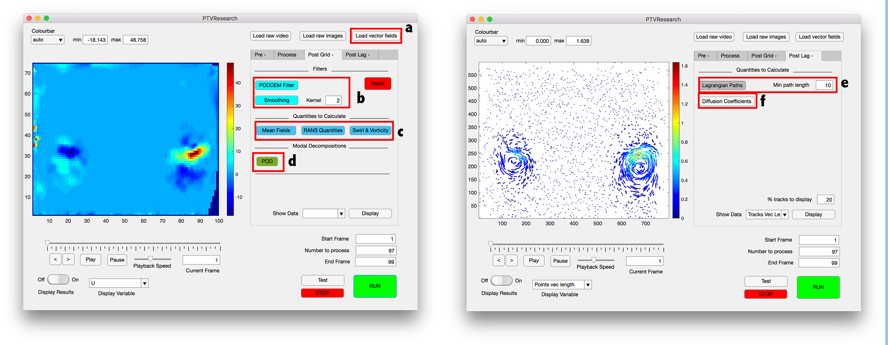
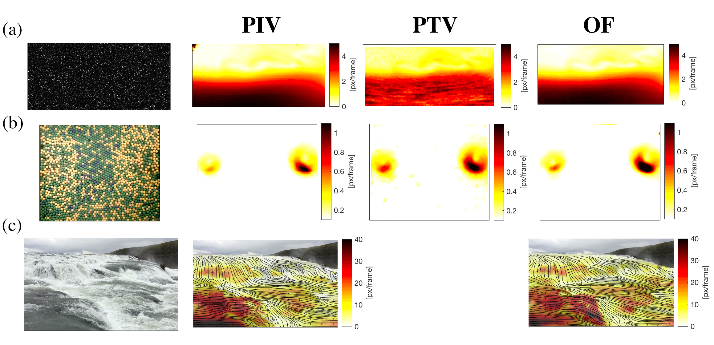

# Summary
PTVResearch is a state-of-the-art particle tracking velocimetry software based on the Lucas-Kanade solutions to the Optical Flow equations [@lucas1981iterative]. The software uses surface features to determine the velocities fields of solids and fluid flows, for a wide range of applications including: fluvial river flows, dense granular flows, and high fidelity fluid mechanics flows. PTVResearch does not only compute high resolution Eulerian and Lagrangian velocity data, but also incorporates advanced pre- and post- processing tools. The MatLab based graphical user interface installs directly as a toolbox, and can be used without any expertise. 

# Introduction
PTVResearch was developed to be robust and simple to use for any application. Unlike traditional Particle Tracking Velocimetry (PTV) [@brevis2011integrating] and Particle Image Velocimetry (PIV) [@adrian2011particle], PTVResearch is based on Lucas-Kanade solutions the Optical Flow (OF) equations [@lucas1981iterative]. This by no means is a new or novel method, and has been previously implemented with great success [@quenot1998particle],[@miozzi2004particle]. However, to this authors knowledge there are currently no commercial or open-source software applying this method to solid or fluid flows. PTVResearch merely implements this OF based technique, combining it with traditional and state-of-the-art pre- and post- processing tools. PTVResearch works with most popular formats, and can be applied to videos, image sequences and PIV style image sequence pair. As the software implements a method based on feature tracking, unlike traditional PTV, the method is more robust against external influences and does not require regular flow seeding. Furthermore, unlike PIV the velocity computations are not based on regions of two-dimensional correlations, which in many cases means that higher fidelity velocity fields can be obtained [@quenot1998particle],[@miozzi2004particle]. 

# Pre-processing tools 

PTVResearch includes both traditional and advanced pre-processing tools. As shown in  Fig.(1) PTVResearch: (1) Allows a user to import videos or snapshots of all common formats. (2) On each run saves the user defined processing settings, which can then be later imported to re-process data. (3) Includes advanced image dewarping techniques, these allow a user to remove fish-eye lens warping and or remove deformation created by a cameras being placed an oblique angle (these dewarping techniques are implemented by either a dot matrix or a chequer board (see GitHub directory) all of methods implemented are fully described in [@higham2018]). (4) Allows users to interactively mask regions of the image. (5) Includes a variety of different image filters, to help in improve the raw data, such as: background subtraction; image sharpening; a noise removal Wiener filter [@lim1990two]; and localised image intensity normalisation. (6) Incorporates scaling parameters which can be interactively determined from reference object. (7) A snapshot mode for use on PIV images pairs (see [@adrian2011particle] for full description of snapshot method). (8) Calculates Lagrangian paths in the flow. (9) Automatically grids the Lagrangian points. (10) Displays on-the-fly processed vector fields. 

# Post-processing tools

PTVResearch also includes both traditional and advanced post-processing tools. As shown in  Fig.(2) PTVResearch: (a) Allows a user to upload vector fields previously calculated. (b) Includes advanced outlier detection and removal algorithms such as PODDEM [@higham2016rapid] and smoothn [@garcia2011fast]. (c) Can be used to calculated first, second and third order statistics, including those based on invariants of the velocity gradient tensor [@da2008invariants]. (d) Includes the Proper Orthogonal Decomposition [@berkooz1993proper]. (e) Can be used to filter the Lagrangian paths to only include paths greater than a user defined minimum path length. (f) Includes a method to determine the diffusion coefficient of the computed Lagrangian Paths [@vaidheeswaran2017statistics]. 

# Applications 

As shown in Fig.3, three very different examples are used to highlight the robustness of the PTVResearch implemented method: (a) A fluid mechanics problem from the PIV Challenge (case B 2009 [@stanislas2005main}; (b) a two-dimensional dense granular flow [@fullmer2018experimental]; and, (c) an Icelandic river flow [@icelandic] (see Fig.3). The figure compares the time-average statistics of the resultant velocity, created by PTVResearch, to a commonly used PIV code (using two passes 64x64 and 32x32 with 50% overlap)[@thielicke2014pivlab], and a PTV code [@brevis2011integrating]. The OF based and PTV images are gridded to be of the same size as the computed PIV vector fields using a cubic interpolator. The figure clearly highlights the robustness of the OF method, showing in Fig.3(a) similar results for a optimal PIV image, in Fig.3(b) similar results for a optimal PTV image, and highlights the power or feature tracking in Fig.3(c) (something not possible for PTV). All examples are included with the PTVResearch software. 

# Acknowledgements
Thanks go to Dr. Victor Francia and Mr. Kaiqiao Wu (University College London) helping debug the software. Funding provided by Oakridge Institute for Science and Education, and support from the MFAL Lab (NETL). 

